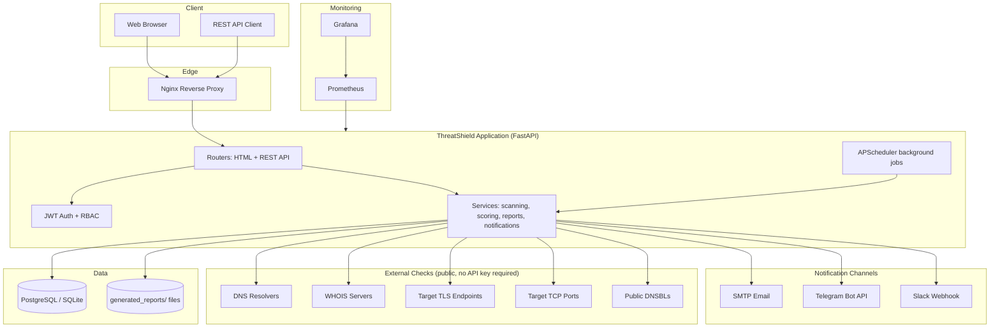
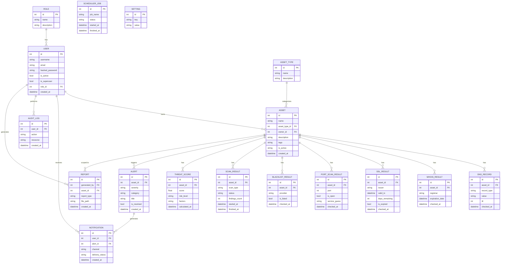
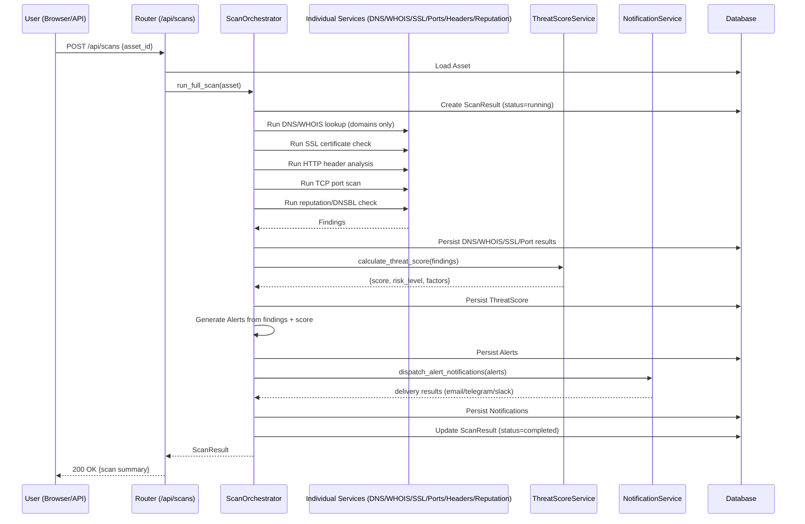
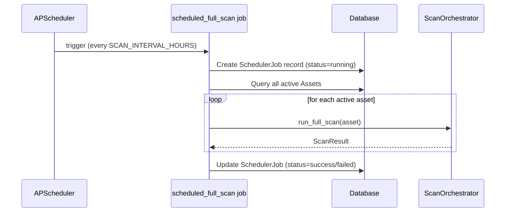
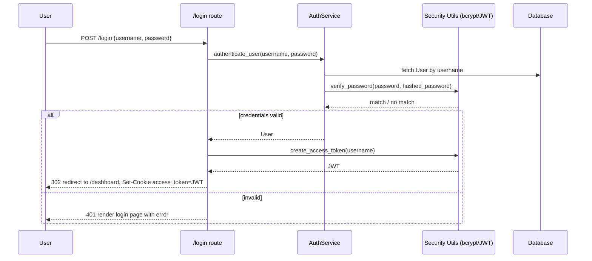

# Architecture & Diagrams

## System Architecture

```mermaid
flowchart TB
    subgraph Client
        Browser[Web Browser]
        APIClient[REST API Client]
    end

    subgraph Edge
        Nginx[Nginx Reverse Proxy]
    end

    subgraph App["ThreatShield Application (FastAPI)"]
        Routers[Routers: HTML + REST API]
        Services[Services: scanning, scoring, reports, notifications]
        Scheduler[APScheduler background jobs]
        Auth[JWT Auth + RBAC]
    end

    subgraph External["External Checks (public, no API key required)"]
        DNS[DNS Resolvers]
        WHOIS[WHOIS Servers]
        TLS[Target TLS Endpoints]
        Ports[Target TCP Ports]
        DNSBL[Public DNSBLs]
    end

    subgraph Data
        DB[(PostgreSQL / SQLite)]
        Reports[(generated_reports/ files)]
    end

    subgraph Notify["Notification Channels"]
        Email[SMTP Email]
        Telegram[Telegram Bot API]
        Slack[Slack Webhook]
    end

    subgraph Monitoring
        Prometheus
        Grafana
    end

    Browser --> Nginx --> Routers
    APIClient --> Nginx
    Routers --> Auth
    Routers --> Services
    Scheduler --> Services
    Services --> DB
    Services --> Reports
    Services --> DNS
    Services --> WHOIS
    Services --> TLS
    Services --> Ports
    Services --> DNSBL
    Services --> Email
    Services --> Telegram
    Services --> Slack
    Prometheus --> App
    Grafana --> Prometheus
```

## Database ER Diagram

```mermaid
erDiagram
    ROLE ||--o{ USER : has
    USER ||--o{ ASSET : owns
    ASSET_TYPE ||--o{ ASSET : categorizes
    ASSET ||--o{ DNS_RECORD : has
    ASSET ||--o{ WHOIS_RESULT : has
    ASSET ||--o{ SSL_RESULT : has
    ASSET ||--o{ PORT_SCAN_RESULT : has
    ASSET ||--o{ BLACKLIST_RESULT : has
    ASSET ||--o{ SCAN_RESULT : has
    ASSET ||--o{ THREAT_SCORE : has
    ASSET ||--o{ ALERT : triggers
    ALERT ||--o{ NOTIFICATION : generates
    USER ||--o{ NOTIFICATION : receives
    USER ||--o{ AUDIT_LOG : performs
    USER ||--o{ REPORT : generates
    ASSET ||--o{ REPORT : "scoped to"

    ROLE {
        int id PK
        string name
        string description
    }
    USER {
        int id PK
        string username
        string email
        string hashed_password
        bool is_active
        bool is_superuser
        int role_id FK
        datetime created_at
    }
    ASSET_TYPE {
        int id PK
        string name
        string description
    }
    ASSET {
        int id PK
        string name
        int asset_type_id FK
        int owner_id FK
        string description
        string tags
        string is_active
        datetime created_at
    }
    DNS_RECORD {
        int id PK
        int asset_id FK
        string record_type
        string value
        int ttl
        datetime checked_at
    }
    WHOIS_RESULT {
        int id PK
        int asset_id FK
        string registrar
        datetime expiration_date
        datetime checked_at
    }
    SSL_RESULT {
        int id PK
        int asset_id FK
        string issuer
        datetime valid_to
        int days_remaining
        bool is_expired
        datetime checked_at
    }
    PORT_SCAN_RESULT {
        int id PK
        int asset_id FK
        int port
        bool is_open
        string service_guess
        datetime checked_at
    }
    BLACKLIST_RESULT {
        int id PK
        int asset_id FK
        string provider
        bool is_listed
        datetime checked_at
    }
    SCAN_RESULT {
        int id PK
        int asset_id FK
        string scan_type
        string status
        int findings_count
        datetime started_at
        datetime finished_at
    }
    THREAT_SCORE {
        int id PK
        int asset_id FK
        float score
        string risk_level
        string factors
        datetime calculated_at
    }
    ALERT {
        int id PK
        int asset_id FK
        string severity
        string category
        string title
        bool is_resolved
        datetime created_at
    }
    NOTIFICATION {
        int id PK
        int user_id FK
        int alert_id FK
        string channel
        string delivery_status
        datetime created_at
    }
    REPORT {
        int id PK
        int generated_by FK
        int asset_id FK
        string report_type
        string file_path
        datetime created_at
    }
    AUDIT_LOG {
        int id PK
        int user_id FK
        string action
        string resource
        datetime created_at
    }
    SCHEDULER_JOB {
        int id PK
        string job_name
        string status
        datetime started_at
        datetime finished_at
    }
    SETTING {
        int id PK
        string key
        string value
    }
```

## Sequence: Running a Scan

```mermaid
sequenceDiagram
    participant U as User (Browser/API)
    participant R as Router (/api/scans)
    participant O as ScanOrchestrator
    participant S as Individual Services (DNS/WHOIS/SSL/Ports/Headers/Reputation)
    participant T as ThreatScoreService
    participant N as NotificationService
    participant DB as Database

    U->>R: POST /api/scans {asset_id}
    R->>DB: Load Asset
    R->>O: run_full_scan(asset)
    O->>DB: Create ScanResult (status=running)
    O->>S: Run DNS/WHOIS lookup (domains only)
    O->>S: Run SSL certificate check
    O->>S: Run HTTP header analysis
    O->>S: Run TCP port scan
    O->>S: Run reputation/DNSBL check
    S-->>O: Findings
    O->>DB: Persist DNS/WHOIS/SSL/Port results
    O->>T: calculate_threat_score(findings)
    T-->>O: {score, risk_level, factors}
    O->>DB: Persist ThreatScore
    O->>O: Generate Alerts from findings + score
    O->>DB: Persist Alerts
    O->>N: dispatch_alert_notifications(alerts)
    N-->>O: delivery results (email/telegram/slack)
    O->>DB: Persist Notifications
    O->>DB: Update ScanResult (status=completed)
    O-->>R: ScanResult
    R-->>U: 200 OK {scan summary}
```

## Sequence: Scheduled Automatic Scan

```mermaid
sequenceDiagram
    participant AP as APScheduler
    participant J as scheduled_full_scan job
    participant DB as Database
    participant O as ScanOrchestrator

    AP->>J: trigger (every SCAN_INTERVAL_HOURS)
    J->>DB: Create SchedulerJob record (status=running)
    J->>DB: Query all active Assets
    loop for each active asset
        J->>O: run_full_scan(asset)
        O-->>J: ScanResult
    end
    J->>DB: Update SchedulerJob (status=success/failed)
```

## Sequence: Login

```mermaid
sequenceDiagram
    participant U as User
    participant R as /login route
    participant AS as AuthService
    participant SEC as Security Utils (bcrypt/JWT)
    participant DB as Database

    U->>R: POST /login {username, password}
    R->>AS: authenticate_user(username, password)
    AS->>DB: fetch User by username
    AS->>SEC: verify_password(password, hashed_password)
    SEC-->>AS: match / no match
    alt credentials valid
        AS-->>R: User
        R->>SEC: create_access_token(username)
        SEC-->>R: JWT
        R-->>U: 302 redirect to /dashboard, Set-Cookie access_token=JWT
    else invalid
        R-->>U: 401 render login page with error
    end
```
